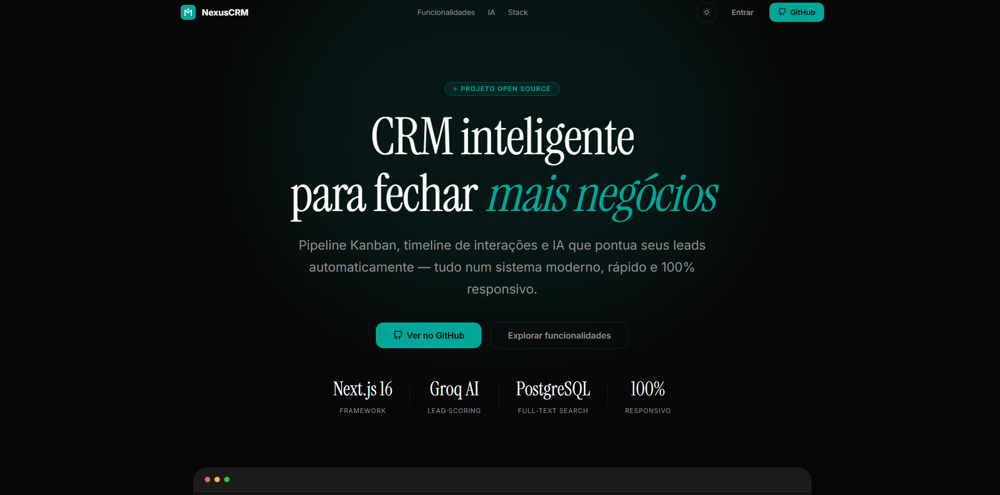
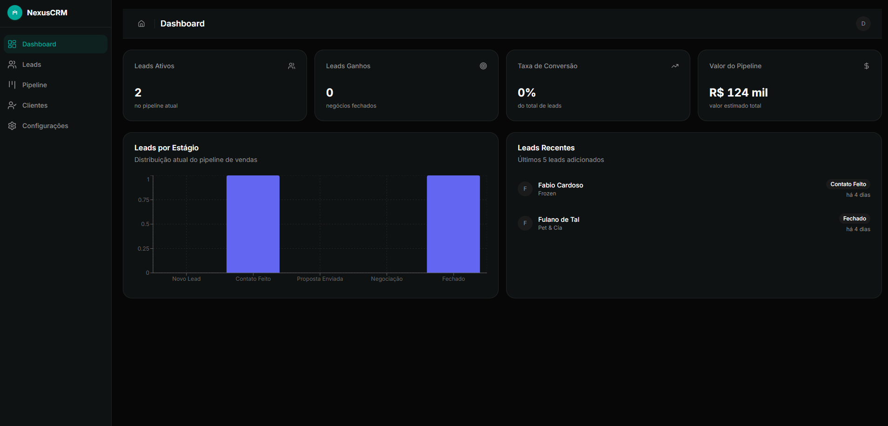
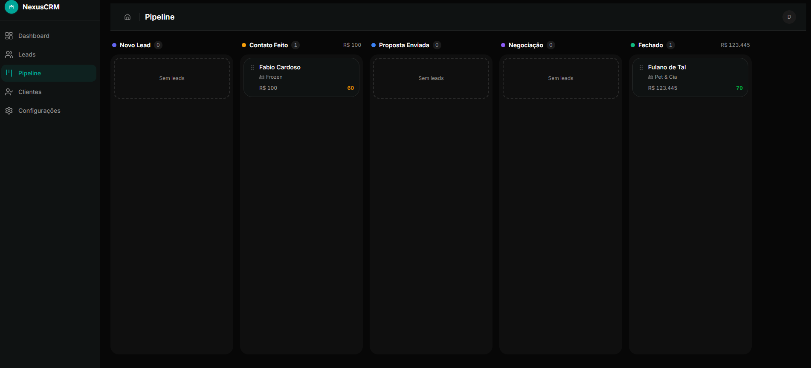
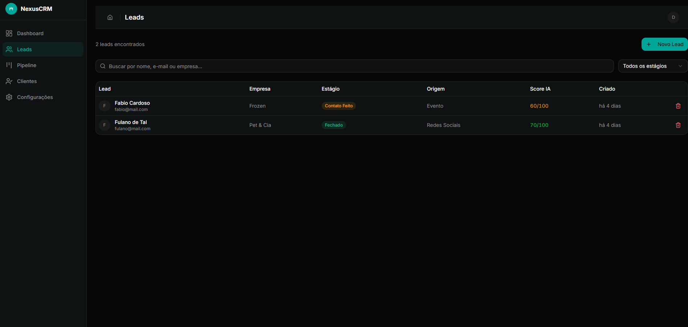
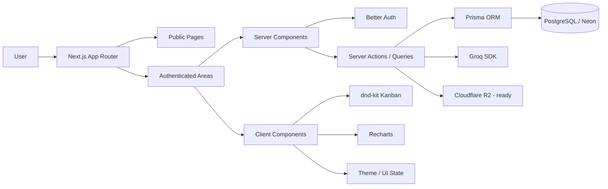

<p align="center">
  <a href="./README.md">Versão em Português</a>
</p>

<p align="center">
  
</p>

<h1 align="center">Nexus CRM</h1>

<p align="center">
  A modern CRM for lead management, sales pipeline operations, and customer follow-up,
  built with a strong focus on <strong>real product thinking</strong>, <strong>scalable architecture</strong>, and <strong>engineering quality</strong>.
</p>

<p align="center">
  <a href="https://mini-crm-sigma-one.vercel.app/"><strong>Live Demo</strong></a>
  ·
  <a href="#overview"><strong>Overview</strong></a>
  ·
  <a href="#features"><strong>Features</strong></a>
  ·
  <a href="#architecture"><strong>Architecture</strong></a>
  ·
  <a href="#local-setup"><strong>Setup</strong></a>
</p>

<p align="center">
  
  
  
  
  
  
  
  
  
  
</p>

---

## Overview

**Nexus CRM** is a sales-oriented customer management system designed to organize leads, track interactions, and provide clear visibility into the sales pipeline.

This project was built as a **real full-stack product**, not just a UI showcase.

It combines:

- lead management with a Kanban pipeline
- customer interaction timeline
- multi-user authentication
- KPI dashboard
- PostgreSQL full-text search
- AI-assisted features powered by Groq
- Cloudflare R2-ready file storage layer

**Live demo:**  
👉 https://mini-crm-sigma-one.vercel.app/

---

## Preview

### Landing Page



### Dashboard



### Pipeline



### Leads



---

## Why this project matters

In a senior-level portfolio context, the value of this project is not just in the features themselves, but in **how they are modeled, structured, and delivered**.

**Nexus CRM** demonstrates the ability to:

- turn business requirements into a usable product
- model domain logic in a scalable relational structure
- build a coherent architecture across frontend, backend, and persistence
- integrate authentication, analytics, drag-and-drop, and AI into a single product
- balance user experience with technical clarity
- deliver software with product thinking, not just isolated features

---

## Features

| Category      | Feature                         | Status |
| ------------- | ------------------------------- | ------ |
| Auth          | Email/password login            | ✅     |
| Auth          | User registration               | ✅     |
| Auth          | Database-backed sessions        | ✅     |
| Multi-tenant  | Organization-based tenancy      | ✅     |
| Multi-tenant  | Member access control           | ✅     |
| CRM           | Lead registration               | ✅     |
| CRM           | Kanban sales pipeline           | ✅     |
| CRM           | Drag and drop between stages    | ✅     |
| CRM           | Detailed lead profile           | ✅     |
| CRM           | Interaction timeline            | ✅     |
| CRM           | Lead tags                       | ✅     |
| Analytics     | KPI dashboard                   | ✅     |
| Analytics     | Stage conversion metrics        | ✅     |
| Analytics     | Average ticket / pipeline value | ✅     |
| Search        | PostgreSQL full-text search     | ✅     |
| Export        | CSV export                      | ✅     |
| AI            | Groq lead scoring               | ✅     |
| AI            | Next action suggestion          | ✅     |
| UX            | Dark / Light mode               | ✅     |
| UX            | Responsive from 375px to 4K     | ✅     |
| Infra         | Cloudflare R2 ready             | 🟡     |
| Export        | PDF export                      | 🟡     |
| Collaboration | Member invitations              | 🟡     |

---

## Stack

### Frontend

- Next.js 16
- React 19
- TypeScript
- Tailwind CSS v4
- shadcn/ui
- Motion
- Recharts
- dnd-kit
- TanStack Query
- Zustand

### Backend and data

- Next.js App Router
- Server Components
- Server Actions
- Prisma ORM
- PostgreSQL
- Neon
- Better Auth
- Zod
- Groq SDK

### Quality

- Vitest
- Playwright
- ESLint
- TypeScript typecheck

### Runtime

- Bun
- Turbopack

---

## Architecture

```text
src/
├── app/
├── features/
│   ├── auth/
│   ├── dashboard/
│   ├── leads/
│   ├── pipeline/
│   └── marketing/
├── shared/
├── generated/
└── ...
prisma/
├── schema.prisma
└── seed.ts
```

### Visual architecture



---

## Testing strategy

```text
E2E (Playwright)         ← Critical flows: login, create lead, move pipeline
Integration (Vitest)     ← API routes, Prisma queries, AI service
Unit tests               ← Utils, formatters, scoring, validation
```

### Commands

```bash
bun run test
bun run test:watch
bun run test:coverage
bun run test:e2e
bun run test:e2e:ui
bun run test:e2e:headed
```

---

## Local setup

### Requirements

- Bun
- PostgreSQL
- `.env` file

### Install

```bash
bun install
bun run db:generate
bun run db:migrate
bun run db:seed
bun dev
```

Application runs at:

```bash
http://localhost:3000
```

### Environment variables

```env
DATABASE_URL=""
DIRECT_URL=""
BETTER_AUTH_SECRET=""
BETTER_AUTH_URL=""
NEXT_PUBLIC_APP_URL=""
GROQ_API_KEY=""
R2_ACCOUNT_ID=""
R2_ACCESS_KEY_ID=""
R2_SECRET_ACCESS_KEY=""
R2_BUCKET_NAME=""
R2_PUBLIC_URL=""
R2_APPI_URL=""
```

---

## Infrastructure

| Layer         | Technology            |
| ------------- | --------------------- |
| Frontend      | Next.js 16 + React 19 |
| Runtime       | Bun                   |
| Database      | PostgreSQL            |
| Production DB | Neon                  |
| ORM           | Prisma                |
| Auth          | Better Auth           |
| AI            | Groq                  |
| Storage       | Cloudflare R2 (ready) |
| Deploy        | Vercel                |

---

## Senior portfolio value

This project was designed to showcase:

- product thinking
- full-stack execution
- domain modeling
- real authentication
- workflow-oriented UI
- AI integration
- maintainable architecture

In a hiring context, **Nexus CRM** demonstrates the ability to turn a business problem into a coherent software product with strong technical foundations.

---

## Author

**Douglas Maciel**  
Full Stack Developer / Software Engineer

---

## License

This project is available for study, portfolio, and technical demonstration purposes.
