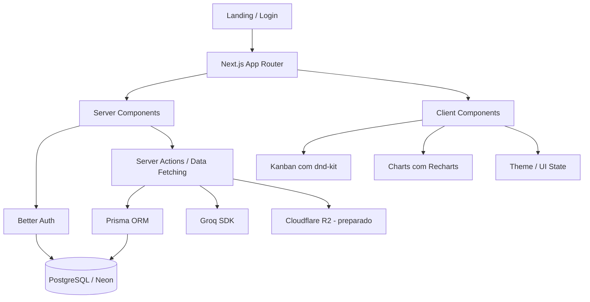

# Nexus CRM

<p align="center">
  <strong>CRM moderno para gestão de leads, pipeline comercial e produtividade de vendas.</strong>
  <br />
  Construído com foco em arquitetura escalável, experiência de produto e qualidade de engenharia.
</p>

<p align="center">
  <a href="https://mini-crm-sigma-one.vercel.app/">Demo</a>
  ·
  <a href="#visão-geral">Visão geral</a>
  ·
  <a href="#stack">Stack</a>
  ·
  <a href="#arquitetura">Arquitetura</a>
  ·
  <a href="#setup-local">Setup local</a>
</p>

<p align="center">
  
  
  
  
  
  
  
  
  
  
</p>

---

## Visão geral

O **Nexus CRM** é um sistema de gestão de clientes focado em **pipeline de vendas**, **acompanhamento de leads** e **eficiência operacional comercial**. O projeto foi concebido para simular um cenário real de produto, com autenticação, multi-tenancy, dashboard analítico, board Kanban e recursos assistidos por IA.

Mais do que um CRUD, este projeto demonstra a construção de um produto full-stack com preocupações reais de engenharia:

- organização por domínio
- autenticação persistida em banco
- isolamento de dados por organização
- modelagem relacional consistente
- UX responsiva e orientada ao fluxo de trabalho
- base preparada para escala e evolução de features

**Demo em produção:**  
👉 https://mini-crm-sigma-one.vercel.app/

---

## Proposta do produto

O projeto resolve um problema comum em times de vendas: manter visibilidade sobre oportunidades, registrar o histórico de relacionamento com cada lead e tomar decisões com base em contexto — não apenas em feeling.

O **Nexus CRM** concentra esse fluxo em uma única aplicação:

- captura e organização de leads
- avanço visual no funil comercial
- timeline de interações
- busca rápida por contexto
- visão consolidada por dashboard
- assistência de IA para priorização

---

## Principais funcionalidades

### Gestão comercial

- Cadastro de leads
- Pipeline de vendas em **Kanban por etapa**
- Movimentação de leads com **drag and drop**
- Controle de status comercial
- Conversão de lead em cliente
- Visualização do valor total em aberto no pipeline

### Contexto e relacionamento

- Perfil detalhado de lead
- Timeline de interações por cliente
- Registro de notas, calls, reuniões, tarefas e mudanças de estágio
- Organização por tags

### Inteligência e análise

- **Lead scoring com IA via Groq**
- Sugestão de próxima ação
- Dashboard com KPIs de vendas
- Conversão por etapa
- Ticket médio
- Leads por estágio
- Busca full-text com PostgreSQL
- Exportação de relatórios em CSV

### Plataforma

- Login e registro por e-mail/senha
- Estrutura multi-usuário
- Isolamento por organização
- Dark mode / Light mode
- Responsivo de **375px até 4K**
- Integração com **Cloudflare R2** preparada

---

## Diferenciais técnicos

O objetivo deste projeto não foi apenas “fazer funcionar”, mas construir com base em decisões que fazem sentido em ambientes profissionais.

### O que este repositório demonstra

- arquitetura orientada por domínio
- separação entre regras de negócio, UI e infraestrutura
- uso moderno do App Router no Next.js
- autenticação integrada ao banco com Better Auth
- modelagem multi-tenant com Prisma
- uso de IA como feature de produto, não como adorno
- preocupação com legibilidade, manutenção e escalabilidade
- estratégia de testes cobrindo fluxos críticos

---

## Stack

### Frontend

- **Next.js 16**
- **React 19**
- **TypeScript**
- **Tailwind CSS v4**
- **shadcn/ui**
- **Motion**
- **Recharts**
- **dnd-kit**
- **TanStack Query**
- **Zustand**

### Backend e dados

- **Next.js App Router**
- **Server Components**
- **Server Actions**
- **Prisma ORM**
- **PostgreSQL**
- **Neon** em produção
- **Better Auth**
- **Zod**
- **Groq SDK**

### Testes e qualidade

- **Vitest**
- **Playwright**
- **ESLint**
- **TypeScript typecheck**

### Runtime e DX

- **Bun**
- **Turbopack**

---

## Arquitetura

O projeto segue uma organização **feature-based**, favorecendo coesão por domínio e facilitando evolução incremental.

```text
src/
├── app/                     # Rotas, layouts e páginas
├── features/                # Módulos por domínio
│   ├── auth/
│   ├── dashboard/
│   ├── leads/
│   ├── pipeline/
│   └── marketing/
├── shared/                  # Infra compartilhada, libs, ui, utils
├── generated/               # Client Prisma gerado
└── ...
prisma/
├── schema.prisma
└── seed.ts
```

### Direção arquitetural

- **App Router** para separação entre áreas públicas e autenticadas
- **Feature folders** para modularidade real de domínio
- **Shared layer** para componentes, libs e infraestrutura reutilizável
- **Prisma** como camada de persistência
- **Better Auth** acoplado ao schema relacional
- **Multi-tenancy por organizationId**
- **Fluxos protegidos no servidor**, evitando depender apenas do client

---

## Diagrama de arquitetura



---

## Modelagem de domínio

A modelagem foi estruturada para refletir um CRM real, com separação clara entre autenticação, organização e operação comercial.

### Núcleo do domínio

- **User**
- **Session**
- **Account**
- **Verification**
- **Organization**
- **OrganizationMember**
- **PipelineStage**
- **Lead**
- **Customer**
- **Interaction**
- **Tag**
- **LeadTag**
- **AiUsageLog**

### Destaques do schema

- suporte nativo a **multi-tenant**
- papéis de acesso por organização
- trilha de interações por lead e cliente
- estágios de pipeline configuráveis
- score e próxima ação armazenados no domínio
- log de uso de IA para auditoria e observabilidade futura
- índices pensados para consultas frequentes

### Regras importantes do domínio

- um usuário pode participar de uma ou mais organizações
- cada organização possui seu próprio pipeline
- leads pertencem a uma organização
- interações criam o histórico vivo do relacionamento
- um lead pode ser convertido em customer
- ações de IA deixam rastro no domínio

---

## Fluxos principais do sistema

### Autenticação

O usuário faz login ou registro com e-mail e senha. A sessão é validada no servidor, e o acesso às áreas protegidas depende do vínculo com uma organização.

### Dashboard

Após autenticado, o usuário acessa uma visão consolidada do negócio com indicadores como:

- total de leads
- oportunidades ganhas
- taxa de conversão
- valor em aberto no pipeline
- leads recentes
- distribuição por etapa

### Pipeline

O pipeline apresenta o funil em formato Kanban, com movimentação visual entre estágios e visão rápida de valor, score e responsável.

### Lead Intelligence

A integração com **Groq** adiciona inteligência ao fluxo comercial:

- score automático do lead
- recomendação de próxima ação
- base para análises futuras do pipeline

---

## Qualidade de engenharia

Este projeto foi desenhado para representar um nível profissional de execução — não apenas na UI, mas principalmente nas decisões por trás dela.

### Práticas adotadas

- organização de código por domínio
- autenticação no servidor
- tipagem forte com TypeScript
- validação com Zod
- modelagem relacional com Prisma
- serialização explícita de valores do banco
- foco em componentes reutilizáveis
- responsividade real, não apenas adaptativa
- base preparada para testes e evolução

---

## Estratégia de testes

A suíte de testes foi pensada em camadas, cobrindo desde lógica isolada até fluxos críticos do usuário.

```text
E2E (Playwright)         ← Fluxos críticos: login, criar lead, mover funil
Integração (Vitest)      ← API Routes, Prisma queries, IA service
Unitários                ← Utils, formatters, scoring e validações
```

### Comandos de teste

```bash
bun run test
bun run test:watch
bun run test:coverage
bun run test:e2e
bun run test:e2e:ui
bun run test:e2e:headed
```

---

## Setup local

### Pré-requisitos

- **Bun**
- **PostgreSQL** local ou remoto
- arquivo `.env` configurado

### 1. Clone o repositório

```bash
git clone <repo-url>
cd mini-crm
```

### 2. Instale as dependências

```bash
bun install
```

### 3. Configure as variáveis de ambiente

Crie um arquivo `.env` na raiz do projeto:

```env
DATABASE_URL=""
DIRECT_URL=""
BETTER_AUTH_SECRET=""
BETTER_AUTH_URL=""
NEXT_PUBLIC_APP_URL=""
GROQ_API_KEY=""
R2_ACCOUNT_ID=""
R2_ACCESS_KEY_ID=""
R2_SECRET_ACCESS_KEY=""
R2_BUCKET_NAME=""
R2_PUBLIC_URL=""
R2_APPI_URL=""
```

### 4. Gere o client Prisma

```bash
bun run db:generate
```

### 5. Execute as migrations

```bash
bun run db:migrate
```

### 6. Rode o seed

```bash
bun run db:seed
```

### 7. Inicie a aplicação

```bash
bun dev
```

A aplicação ficará disponível em:

```bash
http://localhost:3000
```

---

## Scripts disponíveis

```bash
bun dev                 # Desenvolvimento com Turbopack
bun build               # Prisma generate + build de produção
bun start               # Start em produção
bun typecheck           # Verificação de tipos
bun lint                # Lint do projeto

bun run db:generate     # Gera o client Prisma
bun run db:migrate      # Executa migrations
bun run db:push         # Sincroniza o schema com o banco
bun run db:studio       # Abre o Prisma Studio
bun run db:seed         # Popula o banco

bun run test            # Testes automatizados
bun run test:watch      # Testes em watch mode
bun run test:coverage   # Cobertura de testes
bun run test:e2e        # Testes end-to-end
bun run test:e2e:ui     # E2E com interface gráfica
bun run test:e2e:headed # E2E com navegador visível
```

---

## Infraestrutura

### Banco de dados

- **PostgreSQL** como banco principal
- **Neon** em produção
- schema modelado com **Prisma**

### Storage

- estrutura preparada para **Cloudflare R2**
- variáveis de ambiente previstas para integração com assets

### Deploy

- aplicação hospedada em **Vercel**
- demo pública disponível em:  
  https://mini-crm-sigma-one.vercel.app/

---

## Telas principais

O produto foi desenhado em torno de quatro áreas principais:

- **Landing Page**
- **Dashboard**
- **Pipeline**
- **Leads**

> Sugestão: adicionar screenshots ou GIFs logo abaixo desta seção aumenta muito o impacto do repositório no GitHub, especialmente para recrutadores [web:57][web:60].

### Exemplo de seção para screenshots

```md
## Preview

### Landing Page

### Dashboard

### Pipeline

### Leads
```

---

## Trade-offs e decisões

Toda aplicação real envolve escolhas. Algumas decisões deste projeto foram intencionais:

- **Bun** foi adotado para priorizar DX e velocidade no ambiente de desenvolvimento
- **Prisma** foi escolhido pela produtividade, legibilidade do schema e segurança na camada de dados
- **Better Auth** oferece uma base moderna para autenticação integrada ao banco
- **Next.js App Router** foi usado para alinhar o projeto com o ecossistema atual do React
- **Cloudflare R2** foi deixado preparado para expansão da camada de arquivos sem aumentar a complexidade inicial

Esse conjunto de decisões busca equilibrar:

- velocidade de desenvolvimento
- clareza arquitetural
- escalabilidade razoável
- boa experiência de manutenção

---

## Roadmap

Próximas evoluções possíveis do projeto:

- exportação em PDF
- anexos por lead
- filtros salvos
- auditoria de mudanças no pipeline
- permissões mais granulares por papel
- integração com e-mail
- integração com calendário
- dashboards comparativos por período
- insights mais avançados de IA

---

## Valor para recrutadores

Este projeto foi construído para evidenciar competências importantes em times modernos de produto e engenharia:

- capacidade de transformar regra de negócio em software funcional
- domínio de stack full-stack moderna
- pensamento arquitetural
- sensibilidade de produto
- organização de código para escala
- preocupação com testes, DX e experiência final

Em termos práticos, o **Nexus CRM** demonstra um perfil capaz de:

- projetar e modelar domínio
- estruturar backend e frontend de forma coesa
- integrar autenticação, banco, visualização de dados e IA
- entregar uma aplicação com cara de produto real

---

## Autor

**Douglas Maciel**  
Senior Full Stack Developer / Software Engineer

Se este projeto chamou sua atenção, ele representa bem a interseção entre:

- engenharia de software
- produto
- arquitetura moderna
- experiência de usuário

---

## Licença

Este projeto está disponível para fins de estudo, portfólio e demonstração técnica.
