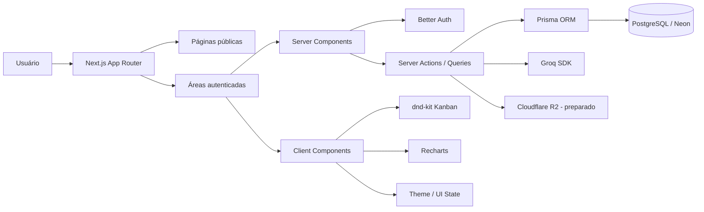

<p align="center">
  <a href="./README.en.md">English version</a>
</p>

<p align="center">
  
</p>

<h1 align="center">Nexus CRM</h1>

<p align="center">
  CRM moderno para gestão de leads, pipeline comercial e acompanhamento de clientes,
  com foco em <strong>produto real</strong>, <strong>arquitetura escalável</strong> e <strong>qualidade de engenharia</strong>.
</p>

<p align="center">
  <a href="https://mini-crm-sigma-one.vercel.app/"><strong>Live Demo</strong></a>
  ·
  <a href="#visão-geral"><strong>Visão geral</strong></a>
  ·
  <a href="#features"><strong>Features</strong></a>
  ·
  <a href="#arquitetura"><strong>Arquitetura</strong></a>
  ·
  <a href="#setup-local"><strong>Setup</strong></a>
</p>

<p align="center">
  
  
  
  
  
  
  
  
  
  
  
</p>

---

## Visão geral

O **Nexus CRM** é um sistema de gestão comercial projetado para organizar leads, acompanhar interações e dar visibilidade real ao funil de vendas. O projeto foi desenvolvido como um **produto full-stack de verdade**, e não apenas como uma vitrine visual.

Ele combina:

- gestão de leads com pipeline Kanban
- timeline de interações por cliente
- autenticação multi-usuário
- dashboard com KPIs comerciais
- busca full-text em PostgreSQL
- recursos assistidos por IA com Groq
- base preparada para upload de assets com Cloudflare R2

**Live demo:**  
👉 https://mini-crm-sigma-one.vercel.app/

---

## Preview

### Landing Page


### Dashboard


### Pipeline


### Leads


---

## Why this project matters

Em um contexto de portfólio sênior, o valor deste projeto não está apenas nas features, mas em **como elas foram estruturadas e entregues**.

O **Nexus CRM** demonstra a capacidade de:

- transformar regras de negócio em um produto utilizável
- modelar domínio de forma relacional e escalável
- construir uma arquitetura coerente entre frontend, backend e persistência
- integrar autenticação, analytics, drag-and-drop e IA em uma mesma aplicação
- equilibrar experiência do usuário com clareza técnica
- entregar software com mentalidade de produto, não apenas de feature isolada

---

## Features

| Categoria    | Feature                        | Status |
| ------------ | ------------------------------ | ------ |
| Auth         | Login com e-mail e senha       | ✅     |
| Auth         | Registro de usuário            | ✅     |
| Auth         | Sessão persistida em banco     | ✅     |
| Multi-tenant | Organização por tenant         | ✅     |
| Multi-tenant | Controle de acesso por membro  | ✅     |
| CRM          | Cadastro de leads              | ✅     |
| CRM          | Pipeline Kanban por etapa      | ✅     |
| CRM          | Drag and drop entre colunas    | ✅     |
| CRM          | Perfil detalhado do lead       | ✅     |
| CRM          | Timeline de interações         | ✅     |
| CRM          | Tags por lead                  | ✅     |
| Analytics    | Dashboard com KPIs             | ✅     |
| Analytics    | Conversão por etapa            | ✅     |
| Analytics    | Ticket médio / pipeline value  | ✅     |
| Search       | Full-text search no PostgreSQL | ✅     |
| Export       | Exportação CSV                 | ✅     |
| IA           | Lead scoring com Groq          | ✅     |
| IA           | Sugestão de próxima ação       | ✅     |
| UX           | Dark mode / Light mode         | ✅     |
| UX           | Responsivo 375px → 4K          | ✅     |
| Infra        | Cloudflare R2 preparado        | 🟡     |
| Export       | Exportação PDF                 | 🟡     |
| Colaboração  | Convite de membros             | 🟡     |

**Legenda:**

- ✅ Implementado
- 🟡 Planejado / em evolução

---

## Stack

### Frontend

- Next.js 16
- React 19
- TypeScript
- Tailwind CSS v4
- shadcn/ui
- Motion
- Recharts
- dnd-kit
- TanStack Query
- Zustand

### Backend e dados

- Next.js App Router
- Server Components
- Server Actions
- Prisma ORM
- PostgreSQL
- Neon
- Better Auth
- Zod
- Groq SDK

### Qualidade

- Vitest
- Playwright
- ESLint
- TypeScript typecheck

### Runtime

- Bun
- Turbopack

---

## Arquitetura

```text
src/
├── app/
│   ├── (auth)/
│   ├── (dashboard)/
│   └── ...
├── features/
│   ├── auth/
│   ├── dashboard/
│   ├── leads/
│   ├── pipeline/
│   └── marketing/
├── shared/
│   ├── components/
│   ├── lib/
│   ├── ui/
│   └── utils/
├── generated/
│   └── prisma/
└── ...
prisma/
├── schema.prisma
└── seed.ts
```

### Arquitetura visual



---

## Modelagem de domínio

Principais entidades do sistema:

- User
- Session
- Account
- Verification
- Organization
- OrganizationMember
- PipelineStage
- Lead
- Customer
- Interaction
- Tag
- LeadTag
- AiUsageLog

### O que a modelagem evidencia

- isolamento por organização
- papéis por membro
- pipeline configurável
- histórico de interações como parte central do produto
- rastreabilidade de uso de IA
- base pronta para expansão funcional

---

## Estratégia de testes

```text
E2E (Playwright)         ← Fluxos críticos: login, criar lead, mover funil
Integração (Vitest)      ← API Routes, Prisma queries, IA service
Unitários                ← Utils, formatters, scoring e validações
```

### Comandos

```bash
bun run test
bun run test:watch
bun run test:coverage
bun run test:e2e
bun run test:e2e:ui
bun run test:e2e:headed
```

---

## Setup local

### Pré-requisitos

- Bun
- PostgreSQL
- arquivo `.env`

### Instalação

```bash
bun install
bun run db:generate
bun run db:migrate
bun run db:seed
bun dev
```

A aplicação estará disponível em:

```bash
http://localhost:3000
```

### Variáveis de ambiente

```env
DATABASE_URL=""
DIRECT_URL=""
BETTER_AUTH_SECRET=""
BETTER_AUTH_URL=""
NEXT_PUBLIC_APP_URL=""
GROQ_API_KEY=""
R2_ACCOUNT_ID=""
R2_ACCESS_KEY_ID=""
R2_SECRET_ACCESS_KEY=""
R2_BUCKET_NAME=""
R2_PUBLIC_URL=""
R2_APPI_URL=""
```

---

## Scripts

```bash
bun dev
bun build
bun start
bun typecheck
bun lint

bun run db:generate
bun run db:migrate
bun run db:push
bun run db:studio
bun run db:seed

bun run test
bun run test:watch
bun run test:coverage
bun run test:e2e
bun run test:e2e:ui
bun run test:e2e:headed
```

---

## Infraestrutura

| Camada      | Tecnologia                |
| ----------- | ------------------------- |
| Frontend    | Next.js 16 + React 19     |
| Runtime     | Bun                       |
| Banco       | PostgreSQL                |
| Produção DB | Neon                      |
| ORM         | Prisma                    |
| Auth        | Better Auth               |
| IA          | Groq                      |
| Storage     | Cloudflare R2 (preparado) |
| Deploy      | Vercel                    |

---

## Roadmap

- [ ] Exportação em PDF
- [ ] Upload de arquivos por lead
- [ ] Convite de membros
- [ ] Permissões mais granulares
- [ ] Integração com calendário
- [ ] Integração com e-mail
- [ ] Dashboards comparativos por período
- [ ] Insights de IA mais avançados

---

## Portfólio sênior

Este projeto foi construído para demonstrar:

- visão de produto
- execução full-stack
- modelagem de domínio
- autenticação real
- interface orientada a workflow
- integração com IA
- preocupação com manutenibilidade

Em um contexto de recrutamento, o **Nexus CRM** evidencia capacidade de transformar problema de negócio em software utilizável, com uma base técnica sólida e pronta para evoluir.

---

## Autor

**Douglas Maciel**  
Full Stack Developer / Software Engineer

Se este projeto chamou sua atenção, ele representa bem minha forma de construir software:  
**produto + arquitetura + execução.**

---

## Licença

Este projeto está disponível para fins de estudo, portfólio e demonstração técnica.
